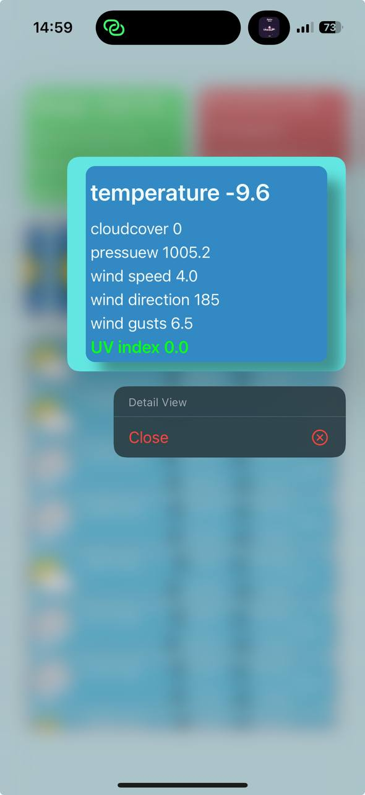
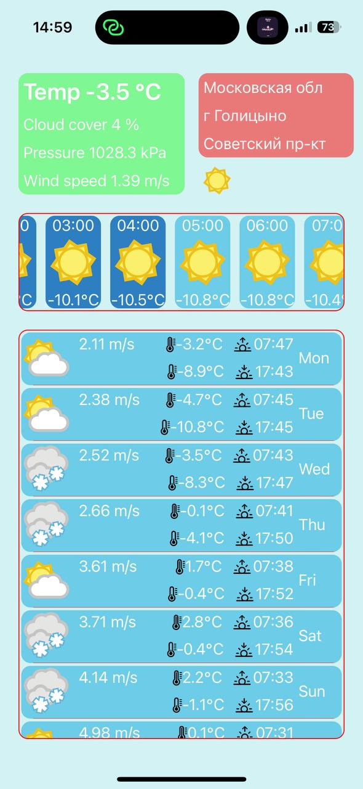

## Table of Contents
1. [Description](#description)
2. [Package_dependencies](#package_dependencies)
3. [Architecture](#architecture)
4. [Tehnologi](#tehnologi)
   - [Network](#etwork)
   - [UI](#ui)
   - [Architecture](#architecture)

## Description

A simple project that show the weather in current place of user.

## Package_dependencies

Weather App is a Swift package that provides...

- **Alamofire**
  - Alamofire is an HTTP networking library written in Swift.
  - Version: 5.8.1
  - github.com/Alamofire/Alamofire.git

- **IIDadata**
  - This package provides access to Dadata address suggestions and reverse geocoding APIs.
  - Version: 0.2.7
  - github.com/illabo/IIDadata.git
  - 
## Architecture
* Weather App project is implemented using the <strong>Model-View-Controller (MVC)</strong> architecture pattern.
* Model has any necessary data or business logic needed to present necessary weather.
* View is responsible for displaying the weather to the user, and updating.
* Controller handles any user  interactions and update the View as needed.
* Project doesn't have a database.  

## Tehnologi

The project demonstrated the skill of using

- **Network**
  -  URLSession with async/await to perform a network request and handle the result using the new concurrency features introduced in Swift 5.5.
  - URLSession with comlition handler
  - Using Alamofire library for network requests

- **UI**
  - Using and applying manual layout using autoLayout
  - Basic and not only methods for setting up collectionView and tableView
 
- **Architecture**
  - MVC
  - Using and applying additional managers-file
  - Сoding style

markdown

